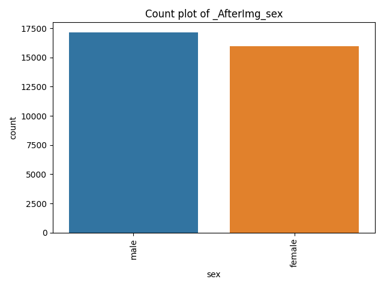
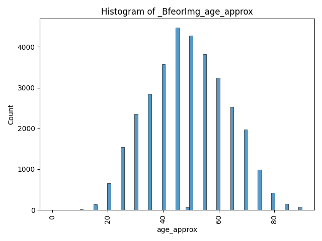
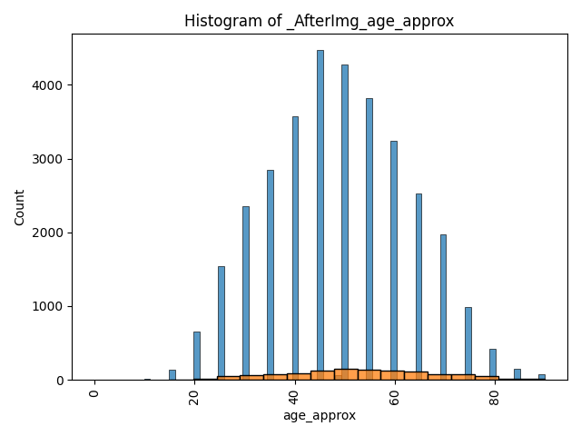
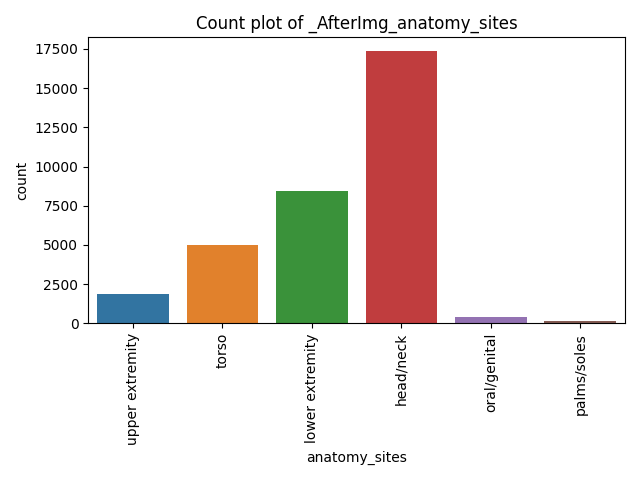
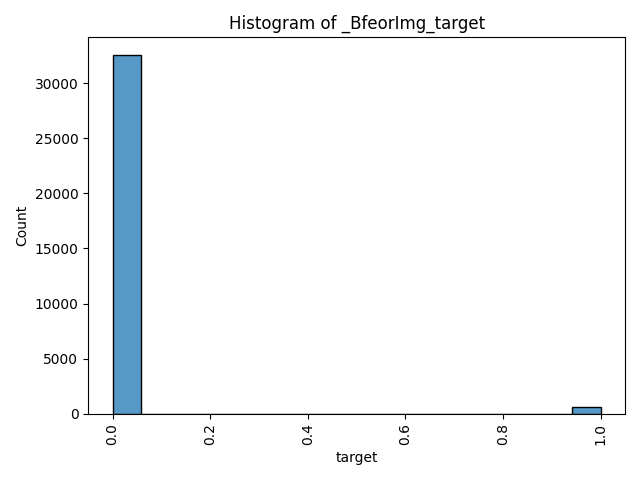
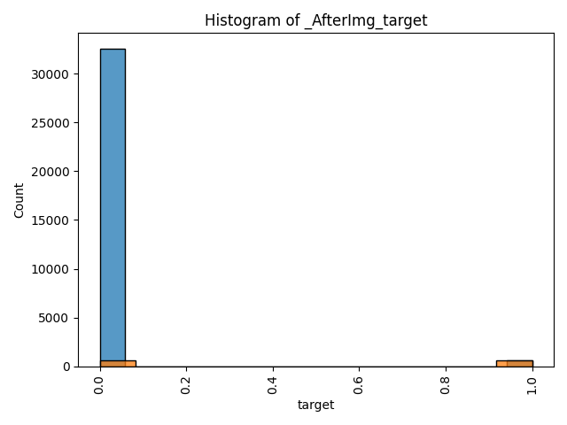
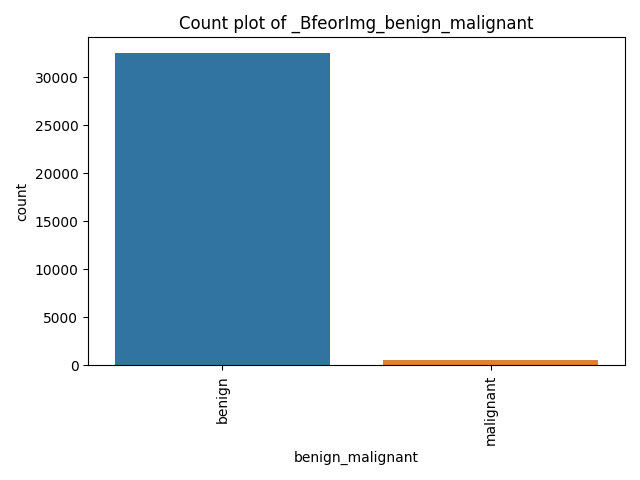
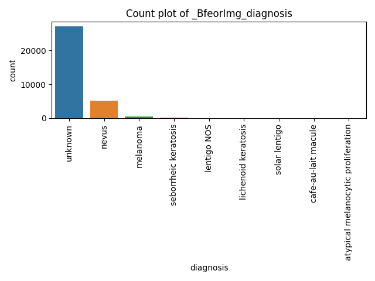

>   **Abstract:**

>   My final capstone project is continuation of assigmnet 20 , which reflects my culmination of learning and understanding in ML in this coures, I have realized that there is still much more to learn to effectively apply it in a real-world context.

>   We are currently in the process of developing an initial Pay-Per-Use dermatology Electronic Medical Record (EMR) solution specifically designed for the Indian market. One essential feature that would greatly assist doctors is a patient complaint triage system. However, our platform, https://symabMED.in, is not yet ready for deployment. To ensure the efficacy and dependability of our solution in real-world situations in India, our system needs to operate continuously for 12 to 18 months. During this phase, we will collect relevant metadata and high-resolution images, accurately categorized, which is crucial for the success of our solution.

>   In the interim, it would be advantageous to develop a generic framework using the HAM10000 dataset. This dataset can serve as a valuable resource for training and conducting initial system testing. By constructing and refining the framework using this dataset, you can evaluate its performance, make necessary enhancements, and acquire valuable insights before incorporating the authentic data from the Indian market. This approach will provide a solid foundation and enable you to iteratively improve the system based on the lessons learned.

>   Skin cancers encompass a range of diseases marked by the presence of abnormal growths or persistent sores that do not heal, as well as alterations in the size, shape, or colour of moles. There are two primary types: melanoma (less prevalent but more hazardous) and non-melanoma skin cancers (more common but less severe).

>   Notably, India experiences a relatively lower incidence of skin cancer than Western countries. This can be attributed, in part, to individuals with darker skin being less susceptible to this condition. The higher levels of melanin in darker skin provide a certain degree of protection against damage caused by UV radiation, thereby reducing the risk of developing skin cancer

>   However, regional variations can play a role in the prevalence of skin cancer in India: our system, in addition to other standard data like age, gender and what is included in the HAM dataset, a new training data may include the following features.

>   Latitude: Regions closer to the equator receive more intense sunlight, increasing the risk of skin cancer. Hence, regions in the southern part of India may see a slightly higher incidence rate.

>   Altitude: Higher altitudes receive more UV radiation. Therefore, areas at higher elevations could potentially have a higher incidence of skin cancer.

>   Outdoor occupations: In regions where more people work outdoors (like farming communities), there are increased sun exposure and a potentially higher risk of skin cancer.

>   Urban vs rural: Urban areas might see different rates due to lifestyle differences, including more indoor work and potentially more access to healthcare for early detection.

>   Cultural and social practices: Clothing, sunscreens, and shade can vary by region and influence skin cancer rates. Some traditional attire covers much of the body, providing natural sun protection

>   I intend to build a generic framework as part of my capstone project. This framework consists of the following routines by taking in DataFrame.

-   Pre and post-reports to provide details of the dataset
-   Remove corrupt images
-   Blancding the dataset
-   standardize the image files
-   feature cleaning and normalization (such as one-hot encoding and replacing null values)
-   identify a suitable machine-learning model for categorization prediction.
-   and if time permits implimating API to input data to get the prdiction.

>   By developing and implementing these routines, I aim to enhance the quality and consistency of the metadata within the dataset, ensuring that it is well-organized and suitable for further analysis, ensuring that the dataset remains reliable and accurate for subsequent image-based analysis and processing.

>   I intend to test this routine using the HAM10000 dataset from the year 2020.

>   If all components of the project work as intended, you will have a comprehensive codebase capable of handling any DataFrame for image classification. Furthermore, the framework will facilitate data visualization and preparation for ML modelling, including selecting appropriate models. Additionally, I aim to provide an API that can be utilized as a real-world service.

>   **Problem Statement**:

>   "Develop a machine learning model to assist dermatologists in India with triaging skin conditions. The model should classify different skin conditions based on images, aiding in quicker and more efficient preliminary diagnosis. The target is to improve the efficiency of dermatologists by reducing their workload, enabling them to focus on more complex and urgent cases. The model is not intended to replace human diagnosis but to supplement it, serving as a first-line screening tool."

-   Step 1: define the row CSV file
-   Step 2: write a code for pre-processing the dataset
    -   Create DataFrame
    -   Sumerzies the datset inormation
    -   Visualize the data set
    -   Report the issues
-   Step 3: write a code for processing the dataset
    -   remove corrupt images and balance the data in the dataset if it is not Balanced.
    -   feature cleaning and normalization (such as one-hot encoding and replacing null values)
    -   standardize the image files and 
    -   Write a new CSV file and images files
-   Step 4: write a code for Post-processing the dataset
    -   Create DataFrame from the new CSV file
    -   Sumerzies the datset inormation
    -   Visualize the data set
    Step 5: write a code to identify a suitable machine-learning model
    -   Compare machine-learning model using Train and Test dataset
    -   Visualize the result
-   Step 6: write an API to execute the model for prediction

\-------------------- -------------------- ----------------

 ------------  -----------------  --------------   --------------

 ### proces directery to see if there is any currept imges
 
 Total Image file count is 33126 
 Total currept imge files count is 0

 Recommendations:
 
  Column 'image_name' is categorical. Consider encoding it using label encoding or one-hot encoding.
 
  Column 'patient_id' is categorical. Consider encoding it using label encoding or one-hot encoding.
 
  Column 'sex' has missing values. Consider using dropna() or fillna().
 
  Column 'sex' is categorical. Consider encoding it using label encoding or one-hot encoding.
 
  Column 'age_approx' has missing values. Consider using dropna() or fillna().
 
  Column 'age_approx' is numerical. Consider scaling it using standard scaling or min-max scaling.
 
  Column 'anatomy_sites' has missing values. Consider using dropna() or fillna().
 
  Column 'anatomy_sites' is categorical. Consider encoding it using label encoding or one-hot encoding.
 
  Column 'diagnosis' is categorical. Consider encoding it using label encoding or one-hot encoding.
 
  Column 'benign_malignant' is categorical. Consider encoding it using label encoding or one-hot encoding.
 
  Column 'target' is numerical. Consider scaling it using standard scaling or min-max scaling.

 Recommendations - END -:

 ## DataFrame info befor process :
|    |   index | Name             |   Count | Non-Null   | Dtype   |
|---:|--------:|:-----------------|--------:|:-----------|:--------|
|  0 |       0 | image_name       |   33126 | non-null   | object  |
|  1 |       1 | patient_id       |   33126 | non-null   | object  |
|  2 |       2 | sex              |   33126 | non-null   | object  |
|  3 |       3 | age_approx       |   33126 | non-null   | float64 |
|  4 |       4 | anatomy_sites    |   33126 | non-null   | object  |
|  5 |       5 | diagnosis        |   33126 | non-null   | object  |
|  6 |       6 | benign_malignant |   33126 | non-null   | object  |
|  7 |       7 | target           |   33126 | non-null   | int64   |

 ## Missing values befor & aftre  process :
|                  |   Befor |   After |
|:-----------------|--------:|--------:|
| age_approx       |       0 |       0 |
| anatomy_sites    |       0 |       0 |
| benign_malignant |       0 |       0 |
| diagnosis        |       0 |       0 |
| image_name       |       0 |       0 |
| patient_id       |       0 |       0 |
| sex              |       0 |       0 |
| target           |       0 |       0 |

 ## Unique values befor & aftre  process :
|                  |   Befor |   After |
|:-----------------|--------:|--------:|
| age_approx       |      20 |      17 |
| anatomy_sites    |       6 |       6 |
| benign_malignant |       2 |       2 |
| diagnosis        |       9 |       4 |
| image_name       |   33126 |    1168 |
| patient_id       |    2056 |     801 |
| sex              |       2 |       2 |
| target           |       2 |       2 |

 ## Value counts befor & aftre  process :
|    | Column           | Value           |   Count Befor |   Count After |
|---:|:-----------------|:----------------|--------------:|--------------:|
|  0 | sex              | male            |         17145 |           656 |
|  1 | sex              | female          |         15981 |           512 |
|  2 | anatomy_sites    | torso           |         17372 |           556 |
|  3 | anatomy_sites    | lower extremity |          8417 |           284 |
|  4 | anatomy_sites    | upper extremity |          4983 |           208 |
|  5 | anatomy_sites    | head/neck       |          1855 |           105 |
|  6 | anatomy_sites    | palms/soles     |           375 |             9 |
|  7 | anatomy_sites    | oral/genital    |           124 |             6 |
|  8 | benign_malignant | benign          |         32542 |           584 |
|  9 | benign_malignant | malignant       |           584 |           584 |
| 10 | target           | 0               |         32542 |           584 |
| 11 | target           | 1               |           584 |           584 |

 ## Descriptive statistics befor and after the process:
|       |   age_approx |        target |   age_approx |      target |
|:------|-------------:|--------------:|-------------:|------------:|
| count |   33126      | 33126         |    1168      | 1168        |
| mean  |      48.8691 |     0.0176297 |      53.2135 |    0.5      |
| std   |      14.3656 |     0.131603  |      15.9521 |    0.500214 |
| min   |       0      |     0         |      15      |    0        |
| 25%   |      40      |     0         |      40      |    0        |
| 50%   |      50      |     0         |      55      |    0.5      |
| 75%   |      60      |     0         |      65      |    1        |
| max   |      90      |     1         |      90      |    1        |

Bfeor and after 

|:-------------------------------------:|:-----------------------------------:|
|:---------  Befor --------------------:|:------------ Aftre ----------------:|

|  | |
|:------------------------------------:|:--------------------------------------:|
|  | |
|:------------------------------------:|:--------------------------------------:|
|  | |
|:------------------------------------:|:--------------------------------------:|
|  | |
|:------------------------------------:|:--------------------------------------:|
|  | |
|:------------------------------------:|:--------------------------------------:|
|  | |
|:------------------------------------:|:--------------------------------------:|

Color_Histograms

|  |

avg_accuracy_score : 0.4897435897435898

avg_precision_score : 0.5923076923076923

avg_recall_score : 0.41359182822597457

avg_f1_score : 0.28553658654543695

Texture_Descriptor

|  |

avg_accuracy_score : 0.6521367521367522

avg_precision_score : 0.633942487207386

avg_recall_score : 0.7233555510939295

avg_f1_score : 0.6753682052255269

Gradient-based_Features

|  |

avg_accuracy_score : 0.7230769230769231

avg_precision_score : 0.6769596971221586

avg_recall_score : 0.8571447023918666

avg_f1_score : 0.7562315385151355

Local_Binary_atterns

|  |

avg_accuracy_score : 0.6521367521367522

avg_precision_score : 0.633942487207386

avg_recall_score : 0.7233555510939295

avg_f1_score : 0.6753682052255269

Based on the scores calculated for the Color_Histograms, Texture_Descriptor, Gradient-based_Features, and Local_Binary_atterns models, here are the recommendation statements for each model:

**Color_Histograms:**
The Color_Histograms model shows moderate performance with an average accuracy score of approximately 49%. It has relatively better precision (59%) than recall (41%) based on the provided scores. The average F1 score of 28.6% suggests a trade-off between precision and recall.
Recommendation: It is recommended to explore alternative feature representations or consider additional models to improve overall performance, as the Color_Histograms model has room for improvement in terms of accuracy, precision, and recall.

**Texture_Descriptor:**
The Texture_Descriptor model exhibits better performance compared to the Color_Histograms model, with an average accuracy score of approximately 65.2%. It shows a relatively balanced precision (63.4%) and recall (72.3%), resulting in an average F1 score of 67.5%.
Recommendation: The Texture_Descriptor model can be further evaluated and optimized to enhance its performance. Fine-tuning the model's hyperparameters or exploring ensemble methods may help improve accuracy, precision, and recall.

**Gradient-based_Features:**
The Gradient-based_Features model demonstrates even better performance than the Texture_Descriptor model, with an average accuracy score of approximately 72.3%. It exhibits a relatively high precision (67.7%) and recall (85.7%), resulting in an average F1 score of 75.6%.
Recommendation: The Gradient-based_Features model appears to be a promising choice. However, further evaluation, optimization, and validation are recommended to ensure the robustness and generalizability of the model.

**Local_Binary_atterns:**
The Local_Binary_atterns model shows performance similar to the Texture_Descriptor model, with an average accuracy score of approximately 65.2%. It exhibits comparable precision (63.4%) and recall (72.3%) scores, resulting in an average F1 score of 67.5%.
Recommendation: Similar to the Texture_Descriptor model, the Local_Binary_atterns model can be further evaluated and potentially fine-tuned to improve its overall performance. Exploring alternative approaches or feature representations may also be considered.

In summary, the Gradient-based_Features model demonstrates the best performance among the four models, followed by the Texture_Descriptor and Local_Binary_atterns models. The Color_Histograms model shows the lowest performance. It is recommended to carefully evaluate each model's strengths and weaknesses and consider further optimization techniques specific to each model to enhance their performance for the given task or problem. Additionally, comparing and combining the models' predictions or exploring ensemble methods could potentially lead to improved results.

