 ## DataFrame info befor process :
|    |   index | Name             |   Count | Non-Null   | Dtype   |
|---:|--------:|:-----------------|--------:|:-----------|:--------|
|  0 |       0 | image_name       |   33126 | non-null   | object  |
|  1 |       1 | patient_id       |   33126 | non-null   | object  |
|  2 |       2 | sex              |   33061 | non-null   | object  |
|  3 |       3 | age_approx       |   33058 | non-null   | float64 |
|  4 |       4 | anatomy_sites    |   32599 | non-null   | object  |
|  5 |       5 | diagnosis        |   33126 | non-null   | object  |
|  6 |       6 | benign_malignant |   33126 | non-null   | object  |
|  7 |       7 | target           |   33126 | non-null   | int64   |

 ## Missing values befor & aftre  process :
|                  |   Befor |   After |
|:-----------------|--------:|--------:|
| age_approx       |      68 |       1 |
| anatomy_sites    |     527 |      16 |
| benign_malignant |       0 |       0 |
| diagnosis        |       0 |       0 |
| image_name       |       0 |       0 |
| patient_id       |       0 |       0 |
| sex              |      65 |       1 |
| target           |       0 |       0 |

 ## Unique values befor & aftre  process :
|                  |   Befor |   After |
|:-----------------|--------:|--------:|
| age_approx       |      18 |      16 |
| anatomy_sites    |       6 |       6 |
| benign_malignant |       2 |       2 |
| diagnosis        |       9 |       4 |
| image_name       |   33126 |    1168 |
| patient_id       |    2056 |     795 |
| sex              |       2 |       2 |
| target           |       2 |       2 |

 ## Value counts befor & aftre  process :
|    | Column           | Value           |   Count Befor |   Count After |
|---:|:-----------------|:----------------|--------------:|--------------:|
|  0 | sex              | male            |         17080 |           669 |
|  1 | sex              | female          |         15981 |           498 |
|  2 | anatomy_sites    | torso           |         16845 |           549 |
|  3 | anatomy_sites    | lower extremity |          8417 |           275 |
|  4 | anatomy_sites    | upper extremity |          4983 |           214 |
|  5 | anatomy_sites    | head/neck       |          1855 |            95 |
|  6 | anatomy_sites    | palms/soles     |           375 |            12 |
|  7 | anatomy_sites    | oral/genital    |           124 |             7 |
|  8 | benign_malignant | benign          |         32542 |           584 |
|  9 | benign_malignant | malignant       |           584 |           584 |
| 10 | target           | 0               |         32542 |           584 |
| 11 | target           | 1               |           584 |           584 |

 ## Descriptive statistics befor and after the process:
|       |   age_approx |        target |   age_approx |      target |
|:------|-------------:|--------------:|-------------:|------------:|
| count |   33058      | 33126         |    1167      | 1168        |
| mean  |      48.87   |     0.0176297 |      53.4619 |    0.5      |
| std   |      14.3804 |     0.131603  |      15.9212 |    0.500214 |
| min   |       0      |     0         |      15      |    0        |
| 25%   |      40      |     0         |      45      |    0        |
| 50%   |      50      |     0         |      55      |    0.5      |
| 75%   |      60      |     0         |      65      |    1        |
| max   |      90      |     1         |      90      |    1        |

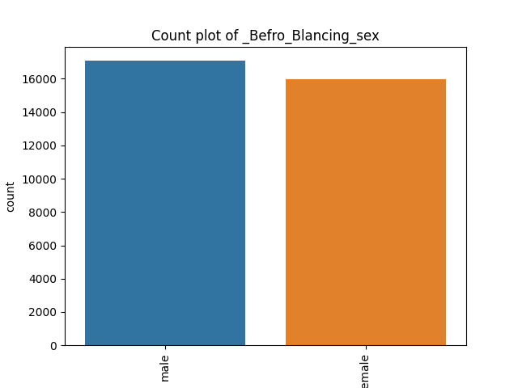

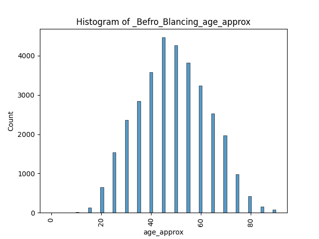

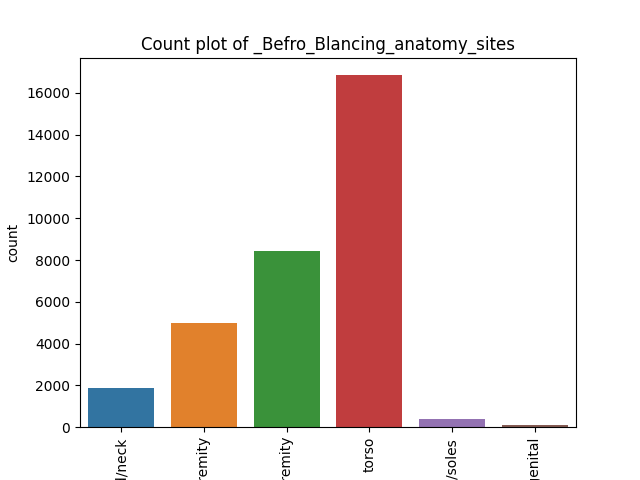

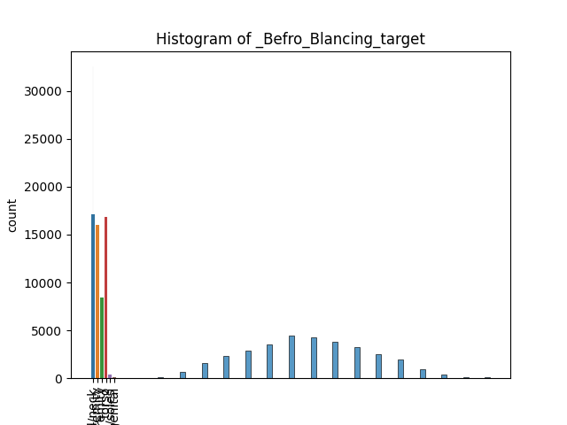

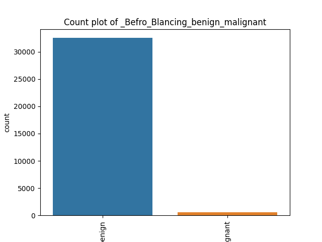

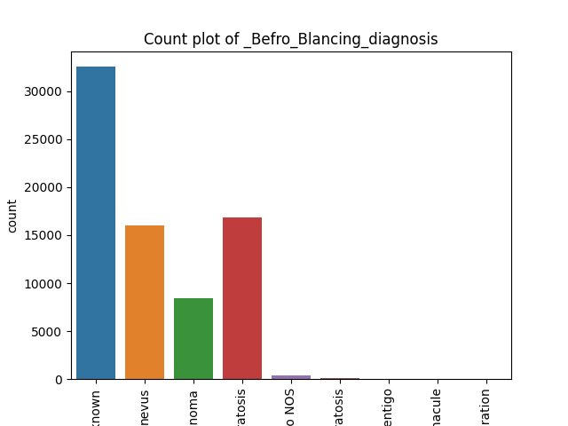

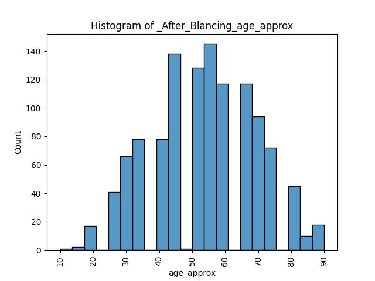

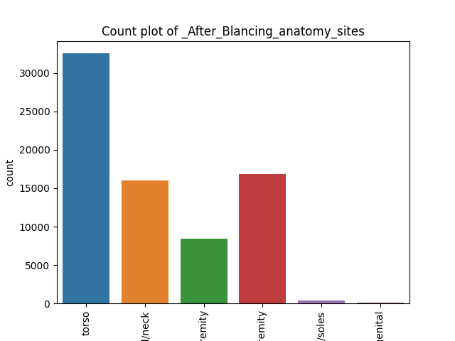

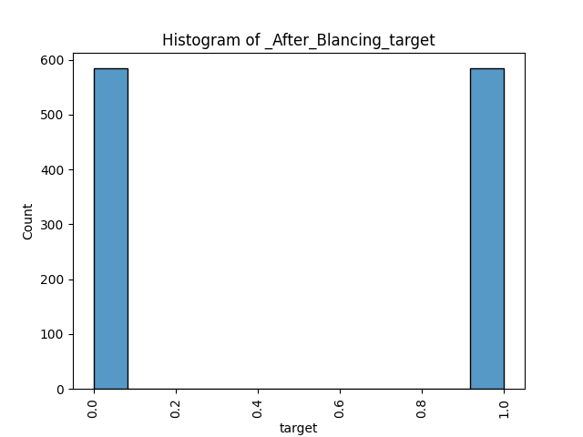

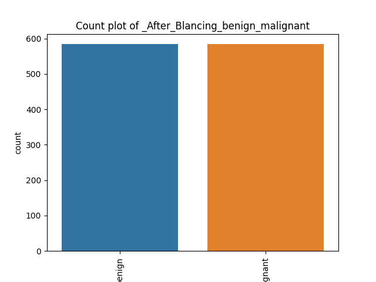

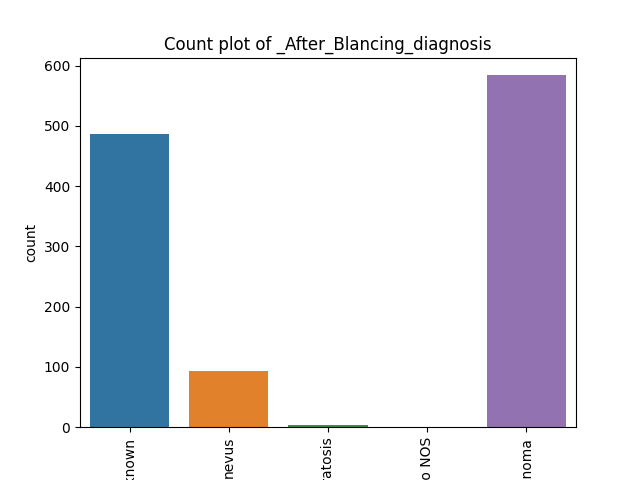

 Recommendations:
 
  Column 'image_name' is categorical. Consider encoding it using label encoding or one-hot encoding.
 
  Column 'patient_id' is categorical. Consider encoding it using label encoding or one-hot encoding.
 
  Column 'sex' is categorical. Consider encoding it using label encoding or one-hot encoding.
 
  Column 'age_approx' is numerical. Consider scaling it using standard scaling or min-max scaling.
 
  Column 'anatomy_sites' is categorical. Consider encoding it using label encoding or one-hot encoding.
 
  Column 'diagnosis' is categorical. Consider encoding it using label encoding or one-hot encoding.
 
  Column 'target' is numerical. Consider scaling it using standard scaling or min-max scaling.
 
  Column 'benign_malignant' is categorical. Consider encoding it using label encoding or one-hot encoding.

 Recommendations - END -:
